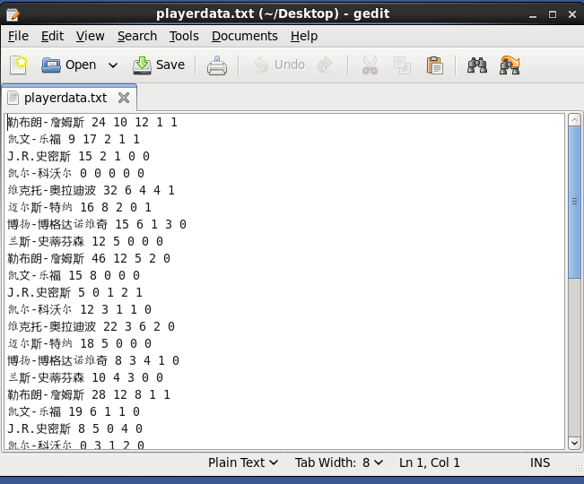
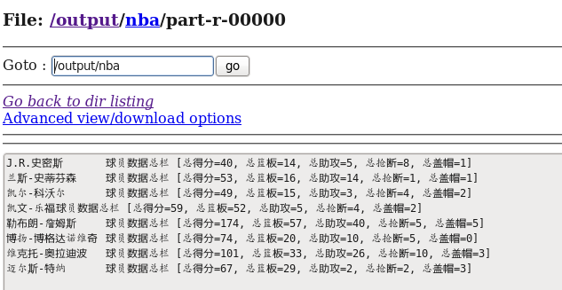

# MapReduce编程-统计球员五项数据
## 1. 目录结构：

**Demo** 文件夹中是整个程序的源码，Demo.jar 是项目导出的 jar 包。

**球员数据** 文件夹是用作统计的数据源。

## 2. MapReduce 介绍

MapReduce是一个并行计算框架，将大数据量的任务拆分成小数据量的任务，分布式计算每一部分的数据，在整合每个数据节点的结果，最后汇总结果。对于可以并行计算的数据，这将降低单机的计算任务，通过多机协作，提高整个平台的计算性能。 

## 3. 项目介绍

本项目基于Hadoop大数据平台，使用 MapReduce 编程，将文本中的格式化的数据统计并输出。由于数据量很小，只统计8名球员5场比赛的5项球员数据，分别是得分、篮板、助攻、抢断、盖帽。 

文本数据如图3-1所示，共40行数据，数据格式（以空格隔开）：球员名 得分 篮板 助攻 抢断 盖帽。（数据来自腾讯NBA官网）

统计结果如下：

## 4. 相关链接

搭建大数据环境，个人博客链接：[在CentOS中搭建Hadoop ](https://wenshixin.gitee.io/blog/2018/03/27/%E5%9C%A8CentOS%E4%B8%AD%E6%90%AD%E5%BB%BAHadoop/)

搭建 MapReduce 的编程环境，个人博客链接：[在CentOS中安装Eclipse和MapReduce编程 ](https://wenshixin.gitee.io/blog/2018/04/12/%E5%9C%A8CentOS%E4%B8%AD%E5%AE%89%E8%A3%85Eclipse%E5%92%8CMapReduce%E7%BC%96%E7%A8%8B/)

球员数据上传到 HDFS 中，HDFS 相关个人博客链接：[HDFS基本命令 ](https://wenshixin.gitee.io/blog/2018/04/02/HDFS%E5%9F%BA%E6%9C%AC%E5%91%BD%E4%BB%A4/)

